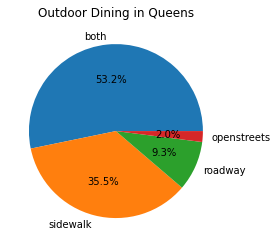

# Queens 

## Summary of Our Work

For our project, we analyzed five neighborhoods within the borough of Queens, New York - Ridgewood, Maspeth, Astoria, Jackson Heights, and Flushing. Within each of these neighborhoods, we analyzed their suitability for outdoor dining during the COVID-19 pandemic using our own criteria. In order to determine how each of our Queens neighborhoods ranked in terms of desirability for outdoor dining, we compared each one using the following desirable qualities: walk score, transit score, and income. Walk Score measures how readily the residents of a neighborhood can access the restaurants. Transit Score measures how readily consumers 
outside the neighborhood you can access the restaurants. Income is used to determine the cost of living. Ridgewood has the best balance of walkability, train access, and income to create an environment ideal for people to start restaurants that have outdoor dining while being easily accessible to people in and out of the area. When comparing the borough of Queens to other boroughs - Bronx, Brooklyn, Manhattan, and Staten Island - the average sidewalk areas are greater than all their average roadway areas. Queens has a stronger preference for sidewalks when compared to the boroughs of Brooklyn and Manhattan. However, when compared to the Bronx, Queens has a weaker preference than the Bronx. Overall, the borough of Queens has a high desirability for outdoor dining.

## More Analysis for Queens

### Comparison of All Five Boroughs 

\
This bar graph compares each borough (Queens, Manhattan, Brooklyn, and the Bronx) and their percentages of sidewalks, roadways, both, and open streets. Based on the percentages, all four boroughs prefer sidewalks to roadways. Within the analyzed boroughs, the average sidewalk areas are greater than all their average roadway areas. Plot #2 further supports the idea synthesized from Plot #1 that Queens has a stronger preference for sidewalks when compared to the boroughs of Brooklyn and Manhattan. However, when compared to the Bronx, Queens has a weaker preference than the Bronx. 

### Outdoor Dining in Queens

\
The pie chart analyzes the number (in percentages) of sidewalks, roadways, both, and open streets within the borough of Queens. The purpose of this pie chart is to give a numerical representation of whether sidewalks or roadways are more common for outdoor dinings in Queens. Overall, the number of sidewalks is greater than the number of roadways. Though Plot #1 does not depict the ratio between average sidewalk area and average roadway area, Plot #2 does. 

### Sidewalk vs. Roadway in Queens

\
This bar graph compares each of our neighborhoods in Queens. This is a comparative bar plot with sidewalk average area in the blue and roadway average area in the orange. There is a clear difference between sidewalk and roadway areas. Plot #3 also supports the idea from Plot #1 and Plot #2 that Queens has a stronger preference for sidewalks, even within 5 of neighborhoods. This difference may be indicative of the space available for outdoor dining. More average space on the sidewalks reflect the higher amounts of sidewalk outdoor dining in Queens compared to the roadway outdoor dining as seen on Plot #2. 

#Individual Neighorhood Links

## [Ridgewood](https://lauren-avilla.github.io/ridgewood)

## [Maspeth](https://NickYaoo.github.io/Maspeth)

## [Astoria](https://two-brain-cells-hard-at-work.github.io/Astoria) 

## [Flushing](https://tszymanski03.github.io/Flushing-Data/)

## [Jackson Heights](https://jonathankogan.github.io/Neighborhood/)

